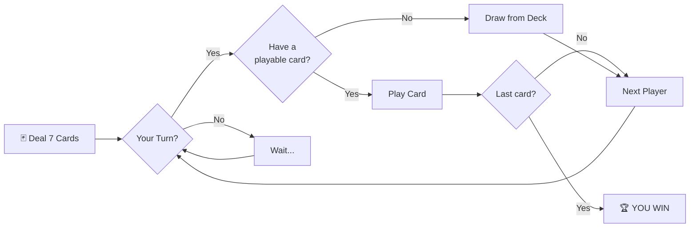
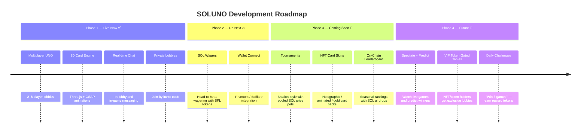

<p align="center">
  
</p>

<h1 align="center">
  🟣 SOL 🔴 UNO 🔵
</h1>

<p align="center">
  <strong>Multiplayer PVP UNO on Solana</strong><br/>
  Real-time 3D card game — play free or wager SOL. No wallet required to start.
</p>

<p align="center">
  <a href="https://playsoluno.vercel.app">🌐 Play Now</a> &nbsp;·&nbsp;
  <a href="https://x.com/i/communities/2037238275539427836">𝕏 Community</a> &nbsp;·&nbsp;
  <a href="#-platform-token">🪙 Token</a> &nbsp;·&nbsp;
  <a href="#-roadmap">🗺️ Roadmap</a>
</p>

---

## ⚡ What is SOLUNO?

SOLUNO is a **real-time multiplayer UNO game** with a full 3D card engine, built for the Solana community. Create a lobby, invite friends (or randoms), and play UNO — the way it was meant to be played: **fast, competitive, and on-chain**.

> No downloads. No wallet needed for free games. Just pick a name and play.

```
┌──────────────────────────────────────────────────────────┐
│                                                          │
│   Enter Username  ──►  Lobby Browser  ──►  3D Game       │
│                        Create / Join       Real-time     │
│                        Public / Private    2–8 Players   │
│                                                          │
└──────────────────────────────────────────────────────────┘
```

---

## 🎮 How to Play

SOLUNO follows **official UNO rules** with real-time multiplayer. Here's the quick version:

### Card Types

```
┌─────────────┬────────────────────────────────────────────┐
│  Card        │  Effect                                   │
├─────────────┼────────────────────────────────────────────┤
│  0-9         │  Match by color or number                 │
│  Skip    ⊘   │  Next player loses their turn             │
│  Reverse ⇄   │  Reverses play direction                  │
│  +2          │  Next player draws 2, loses their turn    │
│  Wild    ★   │  Play anytime — pick a new color          │
│  Wild +4     │  Pick a color + next player draws 4       │
└─────────────┴────────────────────────────────────────────┘
```

### Game Flow



### Rules at a Glance

- **Match** the top card by **color** or **value**
- **Wild cards** can be played on anything — you pick the next color
- **30-second turn timer** — if time runs out, a card is auto-drawn
- **Call UNO** when you're down to 1 card
- **First to empty their hand wins**
- If a player **disconnects**, they forfeit — game continues if 2+ remain

---

## 🏗️ Architecture

```
┌─────────────────────┐         WebSocket          ┌──────────────────────┐
│                     │◄──────────────────────────►│                      │
│   React + Three.js  │    Real-time game state     │   Node.js Server     │
│   Vite + Tailwind   │                            │   Server-Authoritative│
│                     │    Card plays, draws,       │   UNO Engine         │
│   Vercel (Frontend) │    chat, lobby events       │   Render (Backend)   │
│                     │                            │                      │
└─────────────────────┘                            └──────────────────────┘
```

| Layer | Tech | Purpose |
|-------|------|---------|
| **Frontend** | React 18, Three.js, GSAP, Tailwind CSS 4 | 3D card rendering, animations, responsive UI |
| **Backend** | Node.js, `ws` WebSocket library | Server-authoritative game logic, lobby management |
| **Hosting** | Vercel (client) + Render (server) | Auto-deploy from GitHub on push |
| **Future** | Solana Web3.js, SPL Token | On-chain wagers, token-gated features |

---

## 🗺️ Roadmap

Each milestone brings SOLUNO closer to a full on-chain competitive platform.



### Milestone Breakdown

| # | Feature | Status | Description |
|---|---------|--------|-------------|
| 1 | **Multiplayer PVP** | ✅ Live | 2–8 players, real-time 3D, public & private lobbies |
| 2 | **SOL Wagers** | 🔥 Up Next | Wager SOL or any SPL token. Winner takes the pot. |
| 3 | **Tournaments** | 🔜 Soon | Weekly/monthly brackets with pooled prize pots |
| 4 | **NFT Card Skins** | 🔜 Soon | Collectible card backs — trade them on-chain |
| 5 | **On-Chain Leaderboard** | 🔜 Soon | Seasonal ranks, SOL airdrops for top players |
| 6 | **Spectate + Predict** | 🔜 Soon | Watch games live, predict outcomes, earn from the pool |
| 7 | **VIP Tables** | 🔜 Soon | Token-gated high-stakes lobbies |
| 8 | **Daily Challenges** | 🔜 Soon | Complete tasks, earn reward tokens |

---

## 🪙 Platform Token

The **SOLUNO token** helps fund development, new features, tournaments, and platform growth.

```
┌──────────────────────────────────────────────────────────────────┐
│                                                                  │
│  Contract Address (Solana):                                      │
│  4Y4utzQGRtJs24XrdbwCHJyDoCt4NXucTwACofAapump                   │
│                                                                  │
│  🔗 pump.fun launch — community-driven, fair distribution        │
│                                                                  │
└──────────────────────────────────────────────────────────────────┘
```

**Why hold?**
- Future utility: tournament entry, VIP tables, voting on features
- Supports active development and server costs
- Community-first — no VC, no pre-sale dumps

### Token economics & chart utility

| Mechanism | Detail |
|-----------|--------|
| **Bond → DEX** | DEX liquidity is paid at bond — when the token graduates from the bonding curve, LP is funded for the chart. |
| **5% wager rake** | When SOL wagers go live, a **5% rake** on wagers is allocated to **buy back** SOLUNO on the DEX and **burn** supply — supporting the chart and long-term holders. |
| **In-app utility** | The token ties SOLUNO to the Solana ecosystem: perks in-app, VIP tables, tournaments, and future on-chain features as we ship. |

---

## 🚀 Quick Start (Dev)

### Prerequisites
- Node.js 18+
- npm

### Run Locally

```bash
# Install dependencies
npm install

# Start both client + server
npm run dev:all
```

The client runs on `http://localhost:5173` and the WebSocket server on `ws://localhost:3001`.

### Environment

| Variable | Where | Value |
|----------|-------|-------|
| `VITE_WS_URL` | `.env.production` | `wss://uno-pvp-server.onrender.com` |
| `PORT` | Render env | `10000` |

---

## 📁 Project Structure

```
uno/
├── public/                  # Static assets + favicon
├── server/
│   ├── index.js             # WebSocket server entry
│   └── services/
│       ├── UnoEngine.js     # Server-authoritative game logic
│       └── LobbyManager.js  # Lobby lifecycle & matchmaking
├── src/
│   ├── components/
│   │   ├── GameScreen.jsx   # 3D game view (Three.js engine)
│   │   ├── LoginScreen.jsx  # Landing page + token popup
│   │   ├── LobbyBrowser.jsx # Lobby list + create/join
│   │   ├── LobbyRoom.jsx    # Pre-game lobby (ready up)
│   │   └── RoadmapCards.jsx # Shared roadmap card component
│   ├── contexts/
│   │   └── GameContext.jsx  # Global state + WebSocket handler
│   ├── hooks/
│   │   └── useSocket.js    # WebSocket connection hook
│   └── App.jsx             # Screen router
├── render.yaml              # Render deploy blueprint
├── vercel.json              # Vercel deploy config
└── package.json
```

---

## 🤝 Community

<p align="center">
  <a href="https://x.com/i/communities/2037238275539427836">
    <strong>Join the SOLUNO community on 𝕏</strong>
  </a>
  <br/>
  Bug reports, feature ideas, and vibes all welcome.
</p>

---

<p align="center">
  Built with 🃏 by the SOLUNO community<br/>
  <sub>Powered by Solana · React · Three.js · Node.js</sub>
</p>
